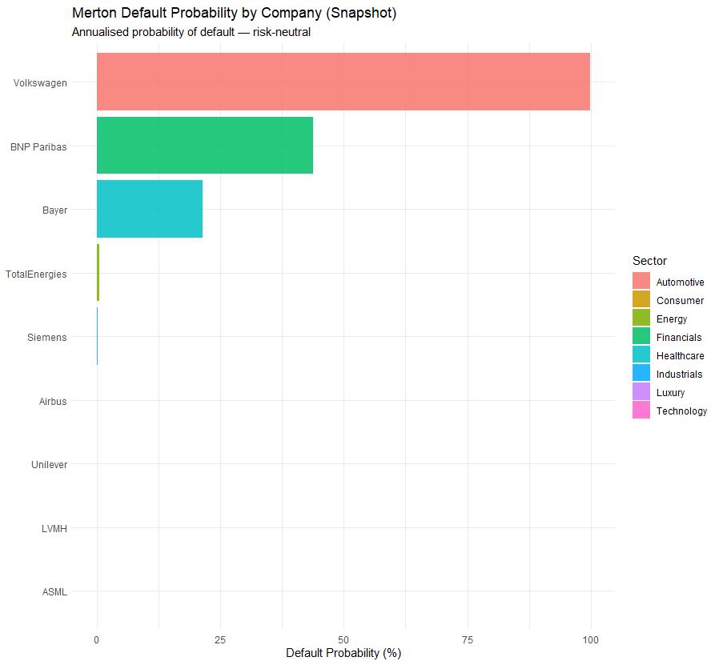
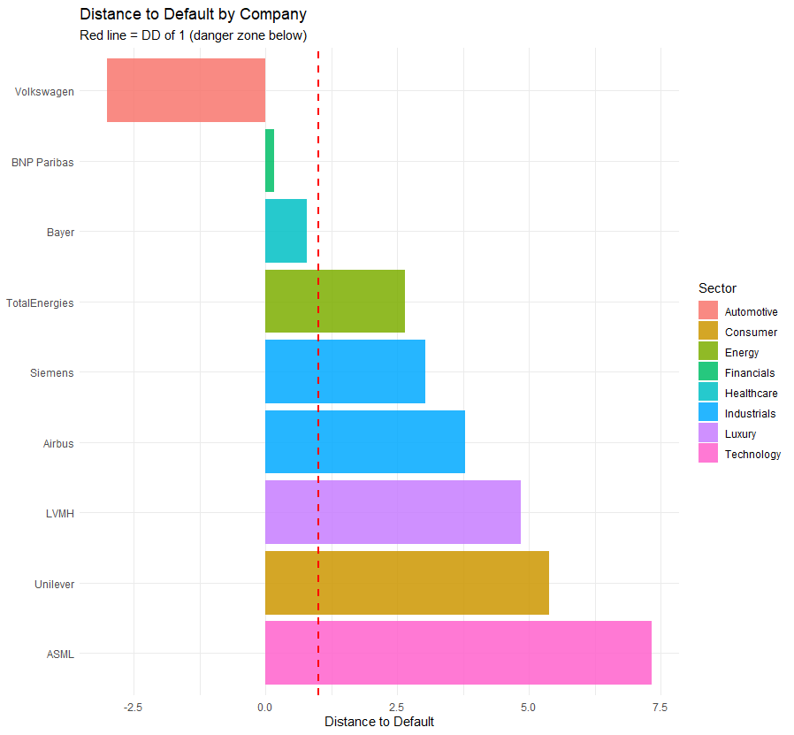
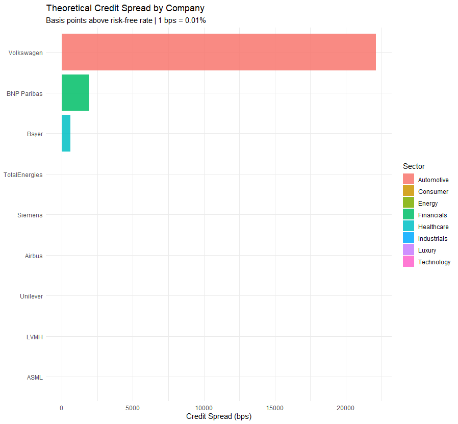
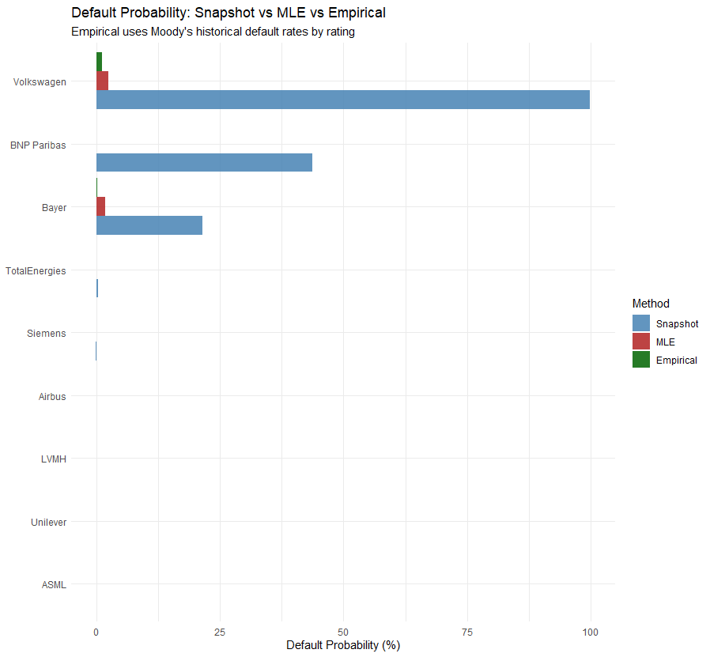
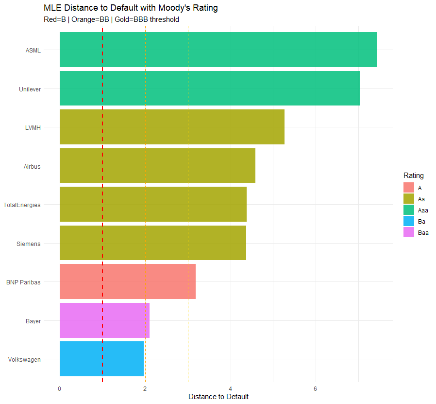
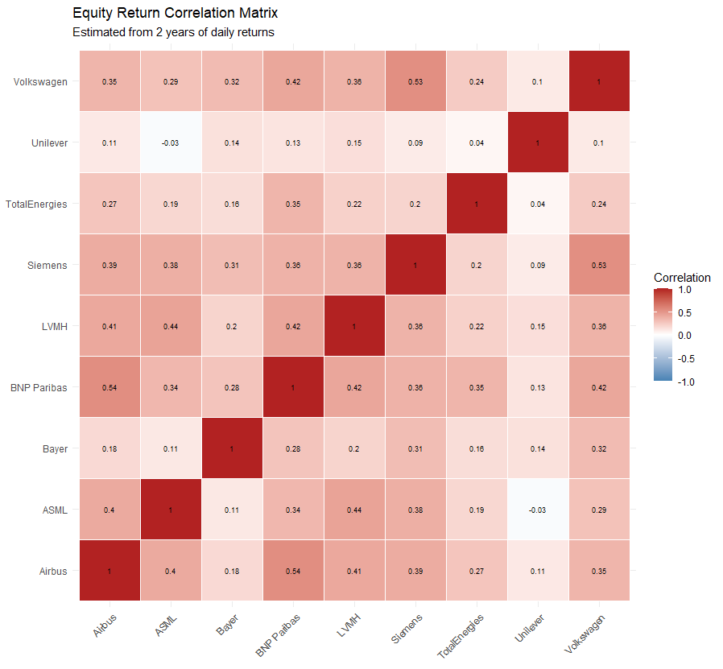
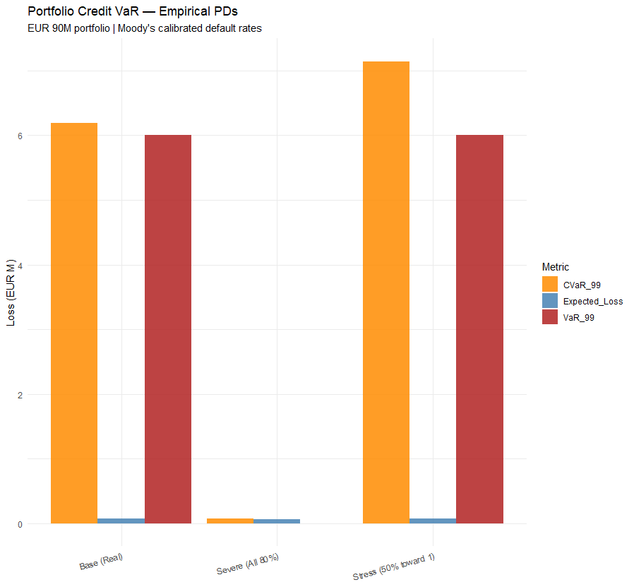
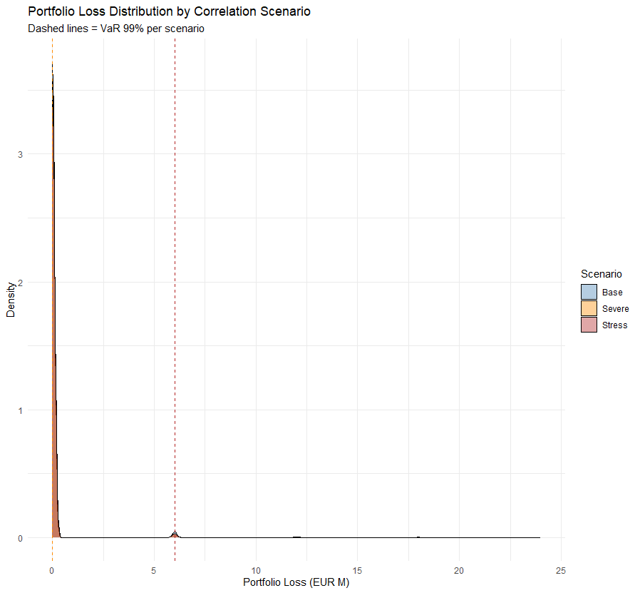

# Credit Risk Modelling — Merton Structural Model

**European Large-Caps | Snapshot vs MLE vs Empirical PD | Gaussian Copula Portfolio VaR**

---

## Overview

This project implements the Merton (1974) structural credit risk model on 9 European large-cap companies across 6 sectors. Three progressively sophisticated approaches are applied: a snapshot Merton implementation, a Maximum Likelihood Estimation (MLE) upgrade using the full price history, and empirical PD calibration using Moody's published historical default rates. Default probabilities feed into a Gaussian copula Monte Carlo simulation to compute portfolio credit VaR under three correlation stress scenarios.

---

## Universe

| Company | Sector | Debt (EUR M) | Maturity |
|---|---|---|---|
| ASML | Technology | 3,200 | 3 years |
| Siemens | Industrials | 38,000 | 3 years |
| TotalEnergies | Energy | 58,000 | 4 years |
| BNP Paribas | Financials | 950,000 | 3 years |
| Volkswagen | Automotive | 192,000 | 3 years |
| LVMH | Luxury | 18,000 | 3 years |
| Bayer | Healthcare | 35,000 | 4 years |
| Unilever | Consumer | 24,000 | 3 years |
| Airbus | Industrials | 15,000 | 4 years |

Debt figures from most recent annual reports (2023/2024). Stock prices downloaded from Yahoo Finance (2022–2026).

---

## Methodology

### The Merton Model

Merton (1974) treats equity as a call option on the firm's assets. Shareholders receive the upside if asset value exceeds debt at maturity, and get nothing if assets fall below debt — exactly the payoff structure of a call option. This means:

```
E = A × N(d1) − D × exp(−rT) × N(d2)
sigma_E × E = N(d1) × sigma_A × A
```

Where E = market equity, A = asset value (unobservable), D = debt, r = risk-free rate, T = maturity, sigma = volatility. Two equations, two unknowns — solved iteratively.

**Distance to Default (DD)** measures how many standard deviations of asset movement separate current asset value from the default boundary (debt level). Higher DD = safer.

**Probability of Default (PD)** = N(−DD) — the probability that asset value falls below debt at maturity under the lognormal asset dynamics assumption.

**Credit Spread** = the extra yield above the risk-free rate that bondholders require to compensate for default risk.

---

## Three Approaches Compared

### 1. Snapshot Merton
Uses today's market equity and 2-year equity volatility as two summary statistics. Fast but sensitive to recent market noise. A single volatile day can distort the entire estimate.

### 2. MLE Merton
Inverts the Merton call option formula for every daily equity observation in the 2-year price history (~500 observations), producing a time series of implied asset values. Asset volatility is estimated as the standard deviation of implied daily asset log returns. An outer iteration loop refines sigma_A until convergence. Uses all available information rather than two summary statistics — substantially more stable.

### 3. Empirical PD (Moody's Calibration)
Maps each company's MLE Distance to Default to a Moody's rating bucket, then assigns the historically observed default rate for that rating. Replaces theoretical N(−DD) with real-world default frequencies from Moody's Annual Default Study 2023 (1983–2022 averages). Conceptually identical to the KMV Expected Default Frequency (EDF) methodology.

| Moody's Rating | DD Range | Historical 1-yr PD |
|---|---|---|
| Aaa | DD > 6 | 0.000% |
| Aa | DD 4–6 | 0.013% |
| A | DD 3–4 | 0.057% |
| Baa | DD 2–3 | 0.166% |
| Ba | DD 1.5–2 | 1.101% |
| B | DD 1–1.5 | 4.378% |
| Caa | DD 0–1 | 14.46% |
| Ca-C | DD < 0 | 30.0% |

---

## Results

### Snapshot Merton — Baseline







The snapshot produces two heavily distorted results. Volkswagen shows 99.9% PD and a 22,115 bps credit spread — an artefact of its €192B debt from Volkswagen Financial Services (auto financing). The model sees massive debt but cannot distinguish between industrial leverage and pass-through lending. BNP Paribas shows 43.8% PD at 89% leverage — structurally correct for a bank but not indicative of distress. Bayer at 21.4% PD is a genuine signal reflecting €35B of debt accumulated from the Monsanto acquisition and ongoing litigation.

---

### MLE vs Snapshot Comparison

| Company | Snapshot DD | MLE DD | Snapshot PD | MLE PD |
|---|---|---|---|---|
| Volkswagen | −3.008 | 1.966 | 99.9% | 2.47% |
| BNP Paribas | 0.157 | 3.192 | 43.8% | 0.07% |
| Bayer | 0.792 | 2.098 | 21.4% | 1.80% |
| TotalEnergies | 2.643 | 4.376 | 0.41% | 0.001% |
| Siemens | 3.037 | 4.371 | 0.12% | 0.001% |
| ASML | 7.330 | 7.427 | ~0% | ~0% |

MLE corrects both structural distortions. Volkswagen's DD recovers from −3.0 to +1.97 — the full price history reveals the company is not in distress, it simply operates with structurally high auto-finance debt. BNP moves from DD 0.16 to 3.19, confirming investment-grade standing. Bayer remains at DD 2.1 — elevated but not extreme — confirming it as the only genuinely stressed company in the universe.

---

### Full Comparison: All Three Methods





| Company | Rating | MLE DD | Snapshot PD | MLE PD | Empirical PD |
|---|---|---|---|---|---|
| Volkswagen | Ba | 1.97 | 99.9% | 2.47% | 1.10% |
| Bayer | Baa | 2.10 | 21.4% | 1.80% | 0.17% |
| BNP Paribas | A | 3.19 | 43.8% | 0.07% | 0.06% |
| Siemens | Aa | 4.37 | 0.12% | 0.001% | 0.01% |
| TotalEnergies | Aa | 4.38 | 0.41% | 0.001% | 0.01% |
| Airbus | Aa | 4.58 | 0.007% | ~0% | 0.01% |
| LVMH | Aa | 5.27 | ~0% | ~0% | 0.01% |
| Unilever | Aaa | 7.04 | ~0% | ~0% | 0.00% |
| ASML | Aaa | 7.43 | ~0% | ~0% | 0.00% |

Volkswagen's Ba rating — speculative grade — is consistent with how credit markets actually price VW bonds given auto-finance structural leverage. Bayer at Baa reflects the Monsanto overhang. BNP at A is appropriate for a major European bank with strong capital ratios.

---

### Correlation Matrix



Estimated from 2 years of daily equity returns. Key observations: Unilever has the lowest correlations across the board (max 0.15) — consumer staples are defensive and driven by company-specific fundamentals rather than macro. Bayer is similarly uncorrelated (max 0.32) — pharmaceutical stocks move on pipeline news. BNP and Airbus have the highest pairwise correlation at 0.54, both sensitive to European economic conditions. TotalEnergies shows low correlations (max 0.35) driven by oil price movements independent of equity market direction.

---

### Portfolio Credit VaR

Portfolio: EUR 90M across 9 bonds (EUR 10M each), 40% recovery rate, 10,000 Monte Carlo simulations using Gaussian copula.

| Scenario | Expected Loss | VaR 99% | CVaR 99% | Max Loss |
|---|---|---|---|---|
| Base (Real correlations) | EUR 0.08M | EUR 6M | EUR 6.19M | EUR 18M |
| Stress (50% toward 1) | EUR 0.08M | EUR 6M | EUR 7.14M | EUR 18M |
| Severe (All 80%) | EUR 0.07M | EUR 0M | EUR 0.07M | EUR 24M |





Expected loss is very low (EUR 0.08M on EUR 90M = 0.09%) because empirical PDs are small for most companies. VaR 99% of EUR 6M in base and stress scenarios is driven by the small probability of Volkswagen and Bayer defaulting simultaneously. The severe scenario (all correlations 80%) shows a mathematically correct but counterintuitive result: VaR 99% drops to zero because with all defaults perfectly correlated and low individual PDs, the probability of any joint default event stays below 1% in 10,000 simulations. CVaR remains meaningful at EUR 7.93M, showing the average loss when a tail event does occur is larger under high correlation — reflecting more simultaneous defaults when they do happen.

---

## Key Findings

**MLE corrects structural distortions that snapshot cannot detect.** Volkswagen's PD drops from 99.9% to 2.47% under MLE — not because the company is safer than it appears, but because the full price history reveals that markets have priced this debt structure as normal operating leverage for decades.

**Bayer is the only genuinely stressed credit in this universe.** Both MLE (1.80%) and empirical (0.17%) methods confirm elevated risk. The Monsanto acquisition created a persistent overhang that fundamental analysis and market pricing both agree on.

**Unilever is the most defensive credit.** DD of 7.04, near-zero correlation with cyclicals, and Aaa empirical rating. The safest bond in any stress scenario.

**CVaR is more informative than VaR for credit portfolios.** VaR is a threshold — it tells you where the bad outcomes start. CVaR tells you how bad they get when they happen. In the severe stress scenario, VaR appears to drop but CVaR rises, capturing the fact that tail losses are larger when defaults cluster.

---

## Limitations

- **Single debt maturity assumption** — Merton requires one maturity date; real companies have complex debt structures with multiple maturities
- **Lognormal asset dynamics** — real asset values have fat tails; Merton underestimates extreme tail risk
- **Auto-finance distortion** — Volkswagen and BNP require balance sheet decomposition to isolate industrial vs financial leverage; full treatment is beyond this model
- **Flat recovery rate** — 40% applied uniformly; in practice recovery varies by seniority, sector, and jurisdiction
- **Gaussian copula tail dependence** — the Gaussian copula underestimates the probability of simultaneous extreme defaults; a Student-t copula would produce heavier joint tails

---

## Dependencies

```r
install.packages(c("quantmod", "tidyverse", "ggplot2", "scales", "Matrix"))
```

---

## How to Run

```r
source("credit_risk_complete.R")
```

Data downloads automatically via `quantmod`. Runtime approximately 3-5 minutes due to MLE outer iteration loop (~500 daily inversions × 9 companies × up to 20 outer iterations).

---

## Project Structure

```
credit-risk/
├── credit_risk_complete.R    # Full pipeline: snapshot, MLE, empirical, VaR
├── README.md
└── plots/
    ├── snapshot_pd.png
    ├── distance_to_default.png
    ├── credit_spread.png
    ├── pd_comparison.png
    ├── rating_dd.png
    ├── correlation_heatmap.png
    ├── portfolio_var.png
    └── loss_distribution.png
```
