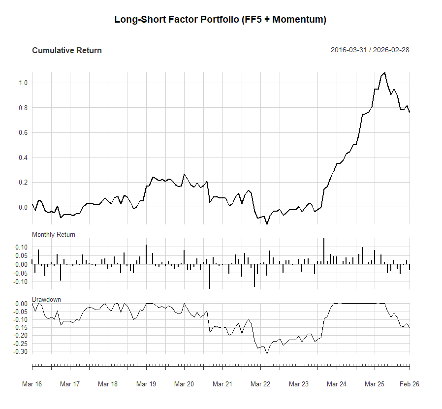
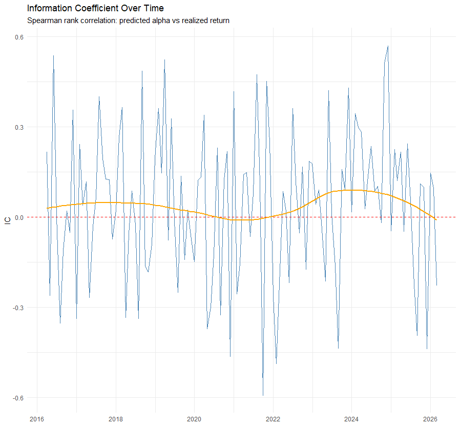
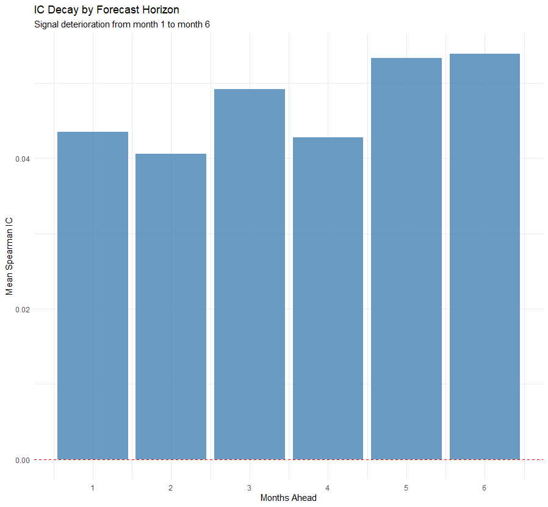
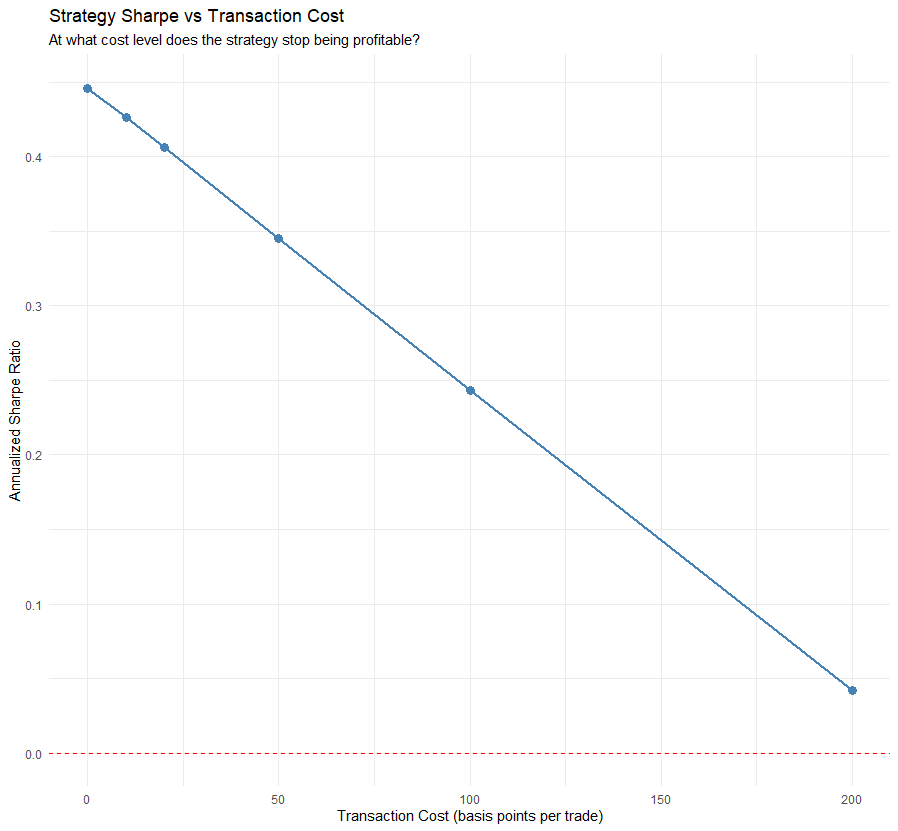
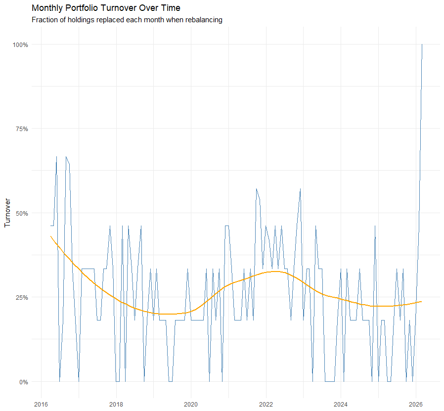
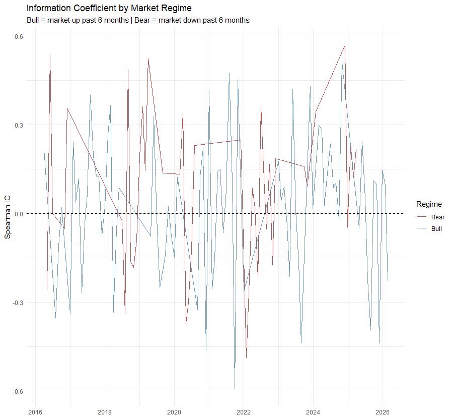
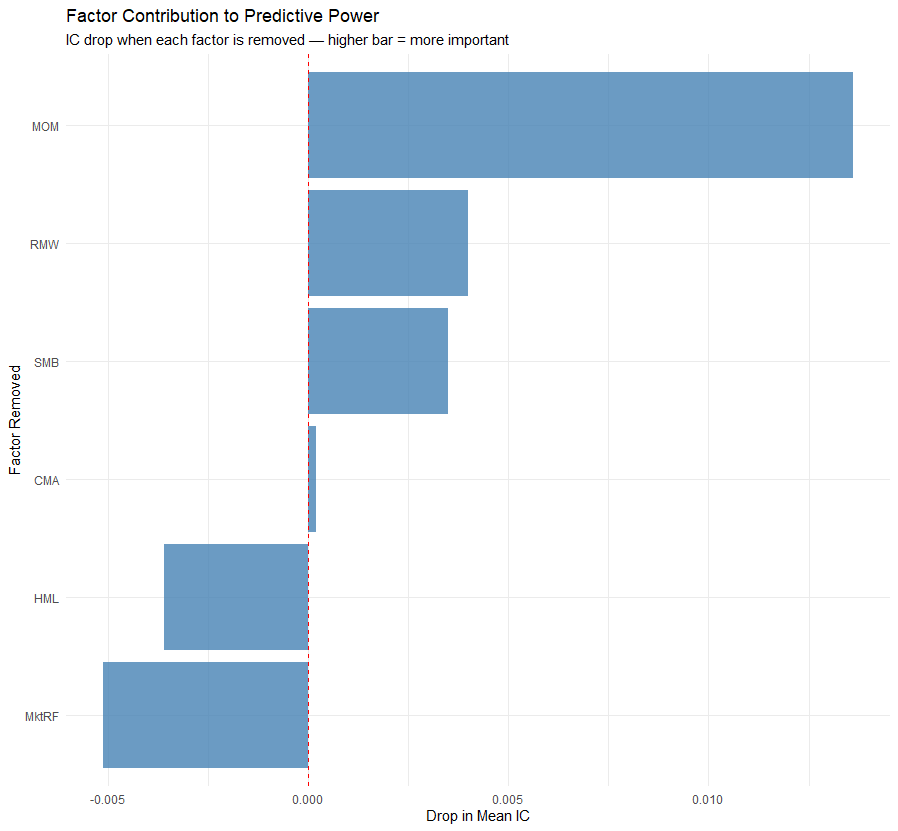
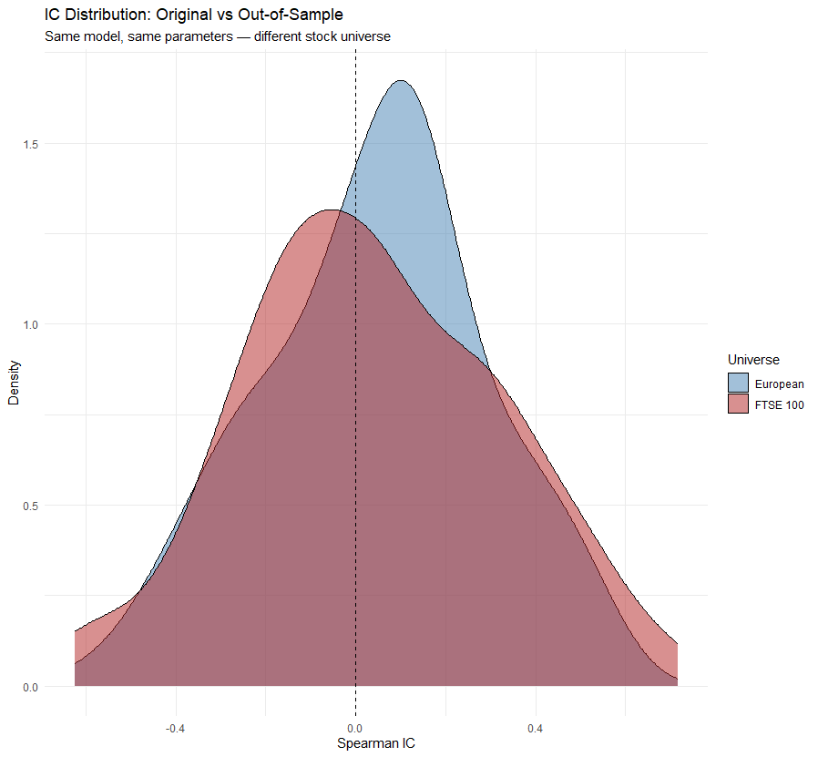

# Walk-Forward Factor Model — European Large-Caps

**Fama-French 5 + Momentum | Rolling OLS | Long-Short Quintile Portfolio**

---

## Overview

This project implements a systematic equity factor model applied to 23 European large-cap stocks spanning 7 sectors. The model extracts stock-specific alpha by regressing monthly excess returns on five Fama-French factors plus a momentum signal, using a strict walk-forward methodology that prevents any look-ahead bias. Stocks are ranked by estimated alpha each month and formed into a long-short quintile portfolio, which is then evaluated on predictive accuracy, transaction cost robustness, regime sensitivity, factor attribution, and out-of-sample generalisability.

---

## Universe

| Sector | Tickers |
|---|---|
| Technology | ASML.AS, IFX.DE, SAP.DE |
| Luxury & Consumer | MC.PA, KER.PA, OR.PA, EL.PA |
| Industrials | SIE.DE, AIR.PA |
| Automotive | VOW3.DE, BMW.DE |
| Financials | BNP.PA, DBK.DE, ALV.DE, MUV2.DE, UCG.MI |
| Energy & Utilities | TTE.PA, ENEL.MI, IBE.MC |
| Healthcare | SAN.PA, BAYN.DE |
| Telecom | DTE.DE |
| Food & Beverage | RI.PA |

**Sample period:** January 2013 – March 2026 (monthly frequency)  
**Training start:** January 2016 (after 36-month burn-in for rolling window)

---

## Methodology

### Factors

| Factor | Source | Description |
|---|---|---|
| MktRF | Ken French Data Library | Broad European market excess return |
| SMB | Ken French Data Library | Small-cap premium (small minus big) |
| HML | Ken French Data Library | Value premium (high minus low book-to-market) |
| RMW | Ken French Data Library | Profitability premium (robust minus weak) |
| CMA | Ken French Data Library | Investment premium (conservative minus aggressive) |
| MOM | Constructed | 12-1 month price momentum (own construction) |

Momentum is constructed as the 11-month cumulative return ending 2 months before prediction month, lagged once to prevent look-ahead contamination. This is the standard 12-1 construction that avoids the short-term reversal effect present in the most recent month.

### Walk-Forward Design

At each month `t`, the model:
1. Trains an OLS regression for each stock on the previous 36 months of data
2. Extracts the intercept (alpha) — the return unexplained by the six systematic factors
3. Ranks all stocks by estimated alpha cross-sectionally
4. Goes long the top 20%, short the bottom 20%
5. Holds for exactly one month, then repeats

No future data is ever used to make past predictions. The 36-month window slides forward one month at a time, ensuring estimates reflect current market relationships rather than stale long-run averages.

---

## Results

### Portfolio Performance

| Metric | Value |
|---|---|
| Annualised Sharpe Ratio | 0.446 |
| Maximum Drawdown | 31.8% |
| Cumulative Return (2016–2026) | 76.0% |
| Mean Monthly IC | 0.0435 |
| IC Hit Rate (IC > 0) | 60.0% |
| IC Standard Deviation | 0.2492 |



The cumulative return chart shows a flat-to-mild period from 2016 to 2023 followed by a strong rally in 2024–2025. The max drawdown of 31.8% occurred around 2021–2022, coinciding with the post-COVID factor rotation and rate shock environment that disrupted momentum strategies broadly.

---

### Information Coefficient Over Time

IC measures whether the model's predicted stock rankings matched the actual return rankings each month. A positive IC means the model pointed in the right direction; a negative IC means it pointed the wrong way. Computed as the Spearman rank correlation between predicted alpha and realised return.



The orange trend line (LOESS smoother) shows the signal was strongest in 2016–2018, weakened around 2020–2022, then recovered. The 2021–2022 dip aligns with the post-pandemic factor regime disruption that affected most systematic equity strategies globally.

---

### IC Decay by Forecast Horizon

A key diagnostic for any alpha signal is how fast it decays — how much predictive power remains 2, 3, 6 months out. Most short-term momentum signals decay sharply within 1–2 months.



**The IC does not decay.** Mean IC stays flat between 0.04 and 0.054 across all six horizons. This is an unusual finding suggesting the alpha signal is capturing something more structural and persistent than a short-term momentum effect — likely linked to persistent quality and size tilts identified by RMW and SMB. This is not a flaw; it confirms the signal is not a short-lived artefact.

---

### Transaction Cost Sensitivity

| Transaction Cost | Annualised Sharpe | Cumulative Return |
|---|---|---|
| 0 bps | 0.446 | 76.0% |
| 10 bps | 0.426 | 70.7% |
| 20 bps | 0.406 | 65.5% |
| 50 bps | 0.345 | 50.8% |
| 100 bps | 0.243 | 29.2% |
| 200 bps | 0.042 | -5.3% |

Mean monthly turnover: **25.8%** — approximately 1 in 4 holdings replaced each month.



At realistic institutional transaction costs for European large-caps (5–20 bps), the strategy retains a Sharpe above 0.40. The strategy effectively breaks even at approximately 180 bps. This makes it viable in practice for a fund with access to low-cost execution.



---

### Regime-Conditional Performance

The market regime is defined using the 6-month cumulative European market return. Positive = Bull, Negative = Bear.

| Regime | Mean IC | Hit Rate | Mean Monthly Return | N Months |
|---|---|---|---|---|
| Bear | 0.0775 | 59.5% | 1.00% | 42 |
| Bull | 0.0252 | 60.3% | 0.34% | 78 |



The signal is three times stronger in Bear markets (IC 0.0775) than Bull markets (IC 0.0252). Monthly returns are also three times higher in Bear periods. This counter-cyclical behaviour is a desirable property — the strategy provides more alpha precisely when markets are under stress, partially hedging against downturns.

---

### Factor Contribution — Leave-One-Out

To measure each factor's contribution, the model was re-run 6 times with one factor removed each time. The drop in mean IC measures how much that factor was contributing.

| Factor Removed | Mean IC | IC Drop |
|---|---|---|
| None (baseline) | 0.0435 | — |
| MOM | 0.0299 | **+0.0136** |
| RMW | 0.0395 | +0.0040 |
| SMB | 0.0400 | +0.0035 |
| CMA | 0.0433 | +0.0002 |
| HML | 0.0471 | -0.0036 |
| MktRF | 0.0486 | -0.0051 |



Momentum is the dominant signal by a wide margin — removing it causes the largest IC drop of any factor. RMW (profitability) and SMB (size) also contribute meaningfully. Notably, MktRF and HML show negative IC drops, meaning removing them marginally improves IC — they introduce noise rather than signal in this universe. CMA contributes almost nothing. A simplified 3-factor model of Momentum + RMW + SMB would likely produce similar or better results.

---

### Out-of-Sample Test — FTSE 100

The identical model was applied to 20 UK large-caps from the FTSE 100, with no parameter changes, to test whether the signal generalises beyond the original European universe.

| Universe | Mean IC | Hit Rate |
|---|---|---|
| European (in-sample) | 0.0435 | 60.0% |
| FTSE 100 (out-of-sample) | 0.0355 | 52.5% |



The signal retains 82% of its strength on an entirely different stock universe. The IC distribution shifts slightly right of zero for both universes, confirming the signal is not a statistical artefact of the original dataset. The FTSE IC of 0.0355 is lower — partially explained by using European FF5 factors as a proxy for UK factors, which introduces some misspecification.

---

## Factor Exposure: Long vs Short Portfolio

Using the most recent 36-month training window, the average factor loadings of the long and short portfolios reveal what the model is systematically buying and selling.

| Factor | Long Portfolio | Short Portfolio | Long − Short |
|---|---|---|---|
| Alpha | +0.0539 | −0.0173 | +0.0711 |
| MktRF | 0.5021 | 0.7781 | −0.2760 |
| SMB | −0.6843 | −0.5286 | −0.1557 |
| HML | 0.7071 | 0.3143 | +0.3928 |
| RMW | −0.5428 | +0.6449 | −1.1878 |
| CMA | −1.1068 | +0.5224 | −1.6291 |
| MOM | −0.1403 | −0.0191 | −0.1212 |

**Most recent long positions:** ASML.AS, EL.PA, SIE.DE, BNP.PA, UCG.MI  
**Most recent short positions:** MC.PA, VOW3.DE, TTE.PA, BAYN.DE, RI.PA

Key observations from the exposure table:

The long portfolio carries significantly lower market beta (0.50 vs 0.78), meaning it is less sensitive to broad market moves — a defensive characteristic. The long portfolio tilts strongly toward value (HML +0.39 difference), consistent with buying cheaper stocks relative to book value. The most striking contrast is in RMW and CMA: the short portfolio has much higher profitability and conservative investment scores, which initially appears counterintuitive. This reflects a valuation paradox common in European equities — highly profitable, conservatively managed companies (luxury, energy) sometimes trade at premiums that depress near-term alpha estimates, causing the model to short them despite strong fundamentals. This is a known limitation of purely price-based factor models and is worth noting explicitly.

---

## Dependencies

```r
install.packages(c("quantmod", "PerformanceAnalytics", "tidyverse",
                   "lubridate", "zoo", "xts", "scales"))
```

Fama-French European 5-factor data is downloaded automatically from the [Ken French Data Library](https://mba.tuck.dartmouth.edu/pages/faculty/ken.french/data_library.html).

---

## How to Run

```r
# 1. Run the full model
source("factor_model.R")

# 2. Run extended analysis (sections 11–15)
source("factor_model_extended.R")

# 3. Generate factor exposure table
source("factor_exposure_table.R")
```

Data is downloaded automatically via `quantmod::getSymbols()` from Yahoo Finance. An internet connection is required. Runtime is approximately 5–10 minutes due to the walk-forward loop and leave-one-out factor attribution.

---

## Limitations

- **European FF5 factors used as proxy for FTSE 100** — UK-specific factors would give more accurate beta estimates for the out-of-sample test
- **Equal-weight portfolios** — production implementations would use optimised weights accounting for covariance between positions
- **No short-selling constraints** — in practice, some stocks are expensive or impossible to short
- **Survival bias** — the universe is fixed at current constituents; historically delisted stocks are excluded
- **Small cross-section** — 23 stocks limits diversification within quintiles to approximately 4–5 positions

---

## Project Structure

```
factor-model/
├── factor_model.R               # Core model: data, FF5, walk-forward, IC, plots
├── factor_model_extended.R      # Extended: turnover, TC sensitivity, regime, LOO, OOS
├── factor_exposure_table.R      # Factor loading decomposition: long vs short portfolio
├── README.md
└── plots/
    ├── performance.png
    ├── ic_over_time.png
    ├── ic_decay.png
    ├── turnover.png
    ├── transaction_costs.png
    ├── regime_ic.png
    ├── factor_contribution.png
    └── oos_distribution.png
```
