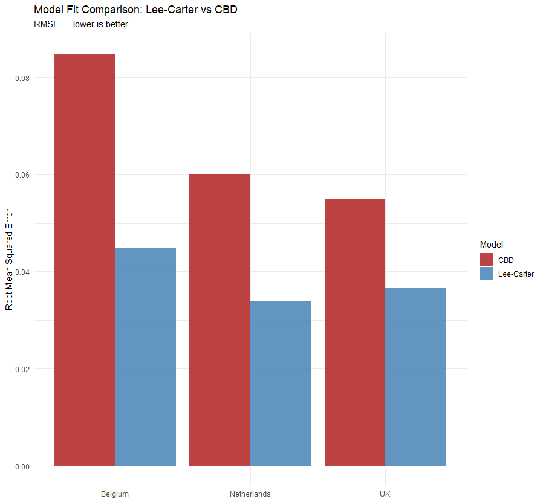
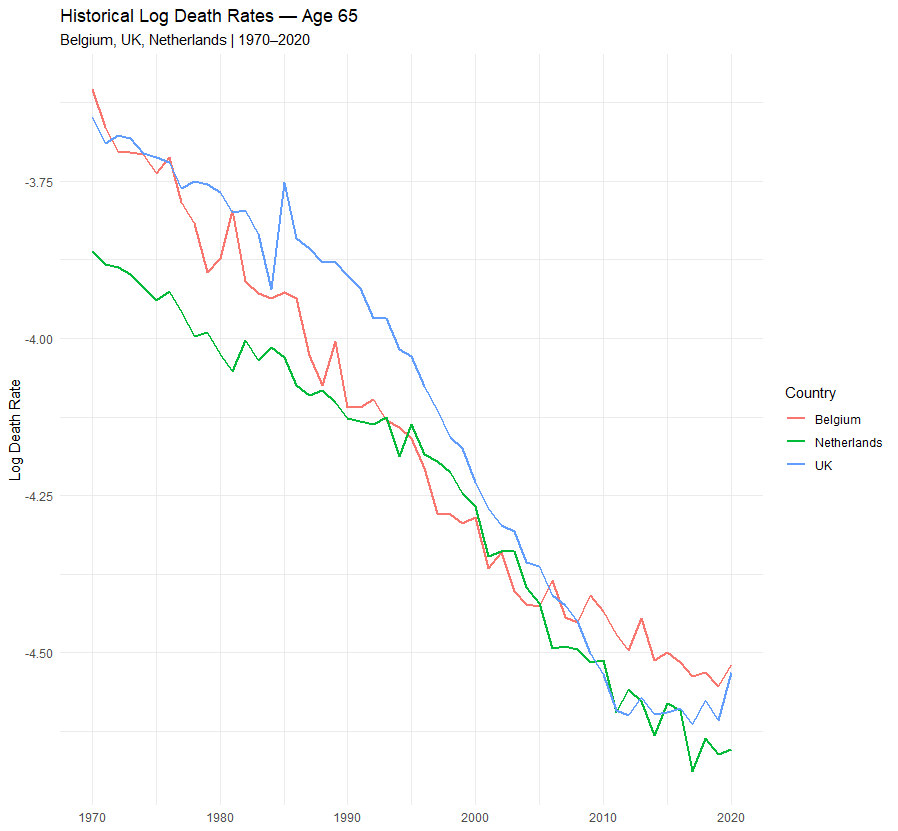
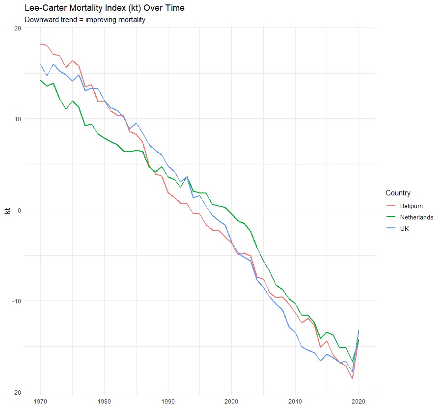
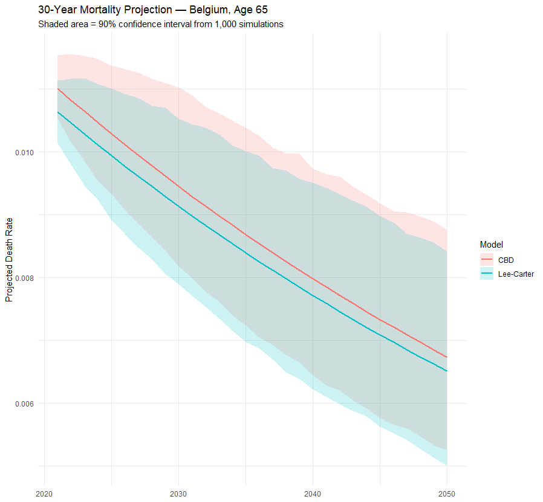
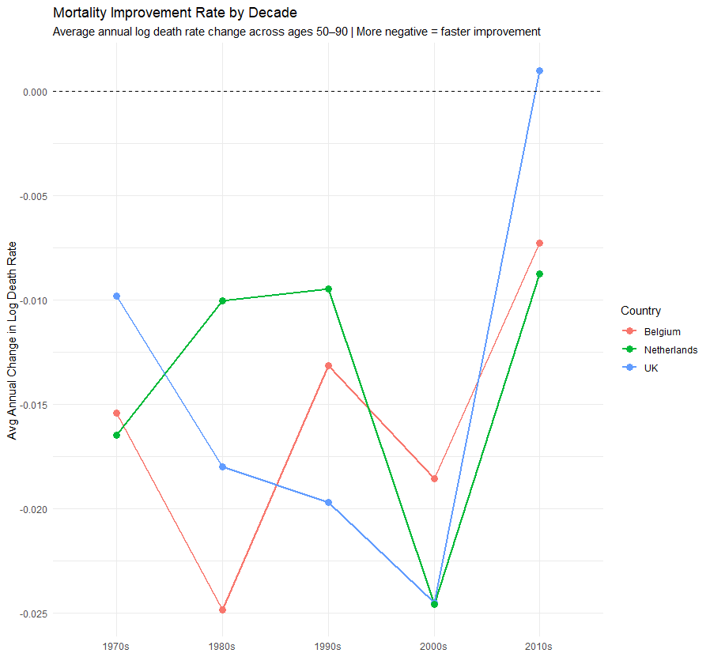
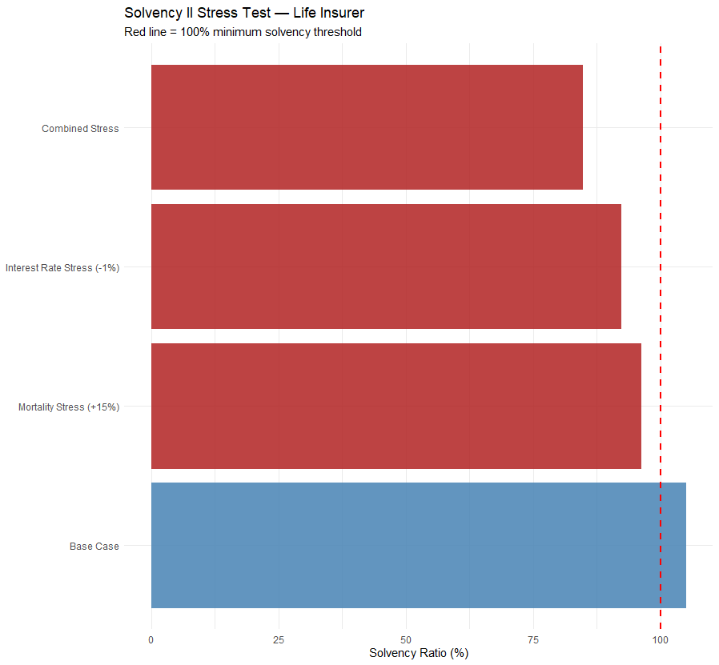
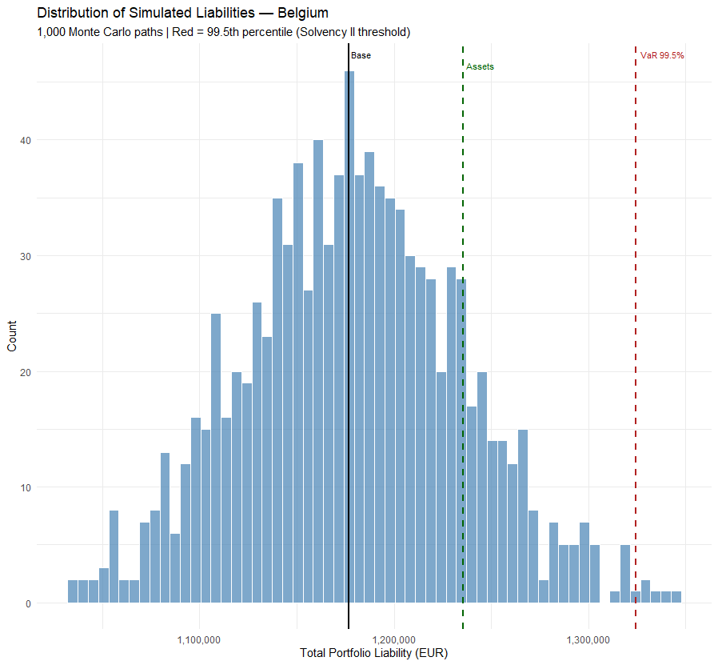
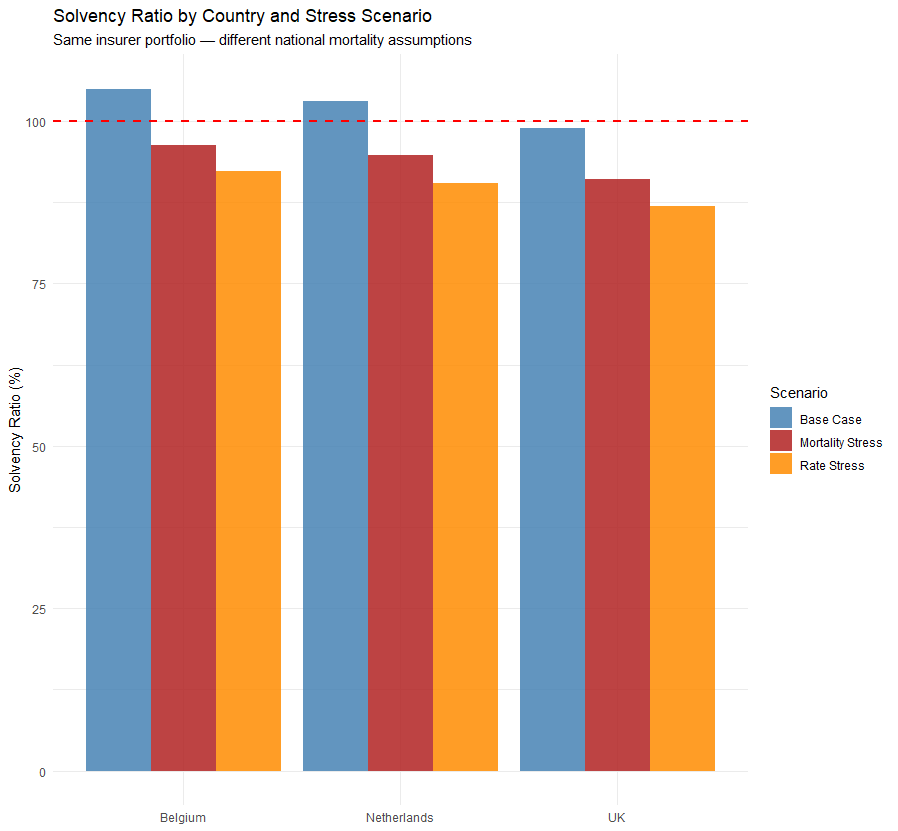

# Stochastic Mortality Modelling & Life Insurer ALM

**Lee-Carter + CBD | Multi-Country | Solvency II Stress Testing**

---

## Overview

This project implements a full actuarial pipeline for stochastic mortality modelling and life insurer asset-liability management across three European countries. Historical death rates from the Human Mortality Database are used to fit and compare two industry-standard mortality models — Lee-Carter and Cairns-Blake-Dowd (CBD). Both models project mortality 30 years forward using Monte Carlo simulation, generating full distributions of future outcomes rather than single-point forecasts. The projections feed directly into a stylized life insurer portfolio to compute liabilities, run Solvency II stress tests, and quantify longevity risk using internal model methodology.

---

## Data

**Source:** [Human Mortality Database](https://www.mortality.org) — the international standard for historical mortality data in developed countries.

| Country | HMD Code | Data Period |
|---|---|---|
| Belgium | BEL | 1841–2020 |
| United Kingdom | GBR_NP | 1922–2020 |
| Netherlands | NLD | 1850–2020 |

**Analysis window:** Ages 50–90, Years 1970–2020  
**Series used:** Mx_1x1 — central death rates by single year of age and single calendar year, both sexes combined

---

## Models

### Lee-Carter (1992)

Decomposes log death rates as:

```
log(mx[x,t]) = ax + bx * kt + error
```

- **ax** — average log death rate at each age (fixed age pattern)
- **bx** — age-specific sensitivity to the time index
- **kt** — time index capturing overall mortality improvement

Fitted by Singular Value Decomposition (SVD) of the demeaned log-mortality matrix. **kt** is then projected forward as a random walk with drift.

### Cairns-Blake-Dowd (2006)

Designed specifically for ages 50+. Models the logit of the death probability:

```
logit(qx[x,t]) = k1t + k2t * (x - xbar)
```

- **k1t** — overall mortality level (intercept)
- **k2t** — age slope (how mortality varies across ages)

Fitted by OLS regression at each calendar year separately. Both **k1t** and **k2t** are projected as independent random walks with drift.

---

## Model Comparison

| Country | LC RMSE | CBD RMSE | LC AIC | CBD AIC | Better Fit |
|---|---|---|---|---|---|
| Belgium | 0.04474 | 0.08489 | −12,731 | −10,110 | Lee-Carter |
| UK | 0.03652 | 0.05482 | −13,580 | −11,939 | Lee-Carter |
| Netherlands | 0.03376 | 0.06005 | −13,909 | −11,558 | Lee-Carter |

Lee-Carter outperforms CBD on both RMSE and AIC across all three countries. This is expected: CBD is a deliberately parsimonious model designed for quick calibration, while Lee-Carter captures age-specific dynamics more flexibly. CBD's higher fitting error does not make it inferior for projection purposes — its structural simplicity makes it more robust to overfitting in some settings.



---

## Results

### Historical Mortality Trends



All three countries show consistent downward trends in log death rates at age 65 from 1970 to 2020, confirming sustained mortality improvement. The Netherlands started with lower mortality than Belgium and UK in 1970 but converged by 2000. The UK shows a notable flattening post-2010.

### Lee-Carter Mortality Index (kt)



The kt index declines steadily across all countries, confirming improving mortality. All three converge toward similar levels by 2020. The sharp uptick visible in 2020 reflects the COVID-19 mortality shock — a transient spike that temporarily reversed the long-run improvement trend.

### 30-Year Mortality Projection



Both Lee-Carter and CBD project continued mortality improvement at age 65 in Belgium through 2050. The CBD central projection is slightly higher (less optimistic about improvement) than Lee-Carter. The shaded confidence intervals from 1,000 Monte Carlo simulations widen substantially over time, reflecting genuine uncertainty about future mortality. By 2050 the 90% interval spans approximately 40% of the central estimate.

---

## Mortality Improvement by Decade



| Country | 1970s | 1980s | 1990s | 2000s | 2010s |
|---|---|---|---|---|---|
| Belgium | −0.0154 | −0.0248 | −0.0131 | −0.0186 | −0.0073 |
| UK | −0.0098 | −0.0180 | −0.0197 | −0.0245 | +0.0010 |
| Netherlands | −0.0165 | −0.0100 | −0.0095 | −0.0246 | −0.0088 |

All three countries show significant deceleration in the 2010s. UK mortality improvement turned **positive** in the 2010s — death rates actually increased slightly — driven by NHS austerity effects and excess winter mortality. Belgium and Netherlands also decelerated sharply. This is a material limitation of the Lee-Carter drift approach: the model averages improvement over 1970–2020 and therefore projects more optimistic future improvement than recent trends justify. A practitioner would adjust the drift downward or use a shorter calibration window.

---

## Life Insurer Portfolio

A stylized whole-life insurance portfolio is used to translate mortality projections into financial liabilities.

| Parameter | Value |
|---|---|
| Number of policyholders | 31 (ages 50–80, one per age) |
| Death benefit | EUR 100,000 per policy |
| Discount rate (base) | 3% per annum |
| Projection horizon | 30 years |
| Asset level | 105% of base liability |
| Base liability | EUR 1,176,828 |
| Assets | EUR 1,235,669 |

The liability is the present value of all future expected death benefit payments, computed by multiplying the survival probability, death probability, benefit amount, and discount factor for each future year.

---

## Solvency II Stress Testing

Solvency II requires European insurers to hold sufficient capital to survive a 1-in-200 year adverse event. Three standard formula stresses are applied.

### Standard Formula Results — Belgium

| Scenario | Liability (EUR) | Assets (EUR) | Solvency Ratio |
|---|---|---|---|
| Base Case | 1,176,828 | 1,235,669 | 105.0% ✓ |
| Mortality Stress (+15%) | 1,283,151 | 1,235,669 | 96.3% ✗ |
| Interest Rate Stress (−1%) | 1,339,294 | 1,235,669 | 92.3% ✗ |
| Combined Stress | 1,457,443 | 1,235,669 | 84.8% ✗ |



The insurer passes the base case but fails all three stress scenarios. The interest rate stress is more damaging than the mortality stress alone — a 1% rate fall raises liabilities by EUR 162k compared to EUR 106k for a 15% mortality deterioration. The combined stress produces a 15.2% capital shortfall, illustrating why Solvency II requires risk aggregation across multiple risk drivers simultaneously.

---

## Longevity VaR — Internal Model Approach

Rather than applying a fixed percentage shock, the longevity VaR is computed directly from the Monte Carlo simulations — each of the 1,000 paths generates a full liability estimate.

| Percentile | Liability (EUR) | Solvency Ratio |
|---|---|---|
| 50th (median) | 1,178,254 | 104.9% |
| 95th | 1,269,249 | 97.4% |
| 99.5th (Solvency II) | 1,324,419 | 93.3% |

**Capital shortfall at 99.5th percentile: EUR 88,750**



The histogram shows the full distribution of simulated liabilities. The base liability (solid black line) sits near the median. The asset level (green dashed) is exceeded by approximately 8% of scenarios. The 99.5th percentile VaR (red dashed) requires EUR 88,750 of additional capital — the economic capital charge for longevity risk under an internal model.

---

## Multi-Country Solvency Comparison

The same portfolio is valued under each country's mortality assumptions to show how national mortality differences affect insurer solvency.

| Country | Base Liability | Base Solvency | Mortality Stress | Rate Stress |
|---|---|---|---|---|
| Belgium | 1,176,828 | 105.0% | 96.3% | 92.3% |
| Netherlands | 1,198,117 | 103.1% | 94.8% | 90.4% |
| UK | 1,249,951 | 98.9% | 91.0% | 86.9% |



The UK insurer fails even the base case (98.9%) despite identical assets, purely due to higher UK mortality rates generating larger near-term expected payments. Belgium is the most favourable jurisdiction for the same portfolio. This illustrates a core actuarial principle: the same product carries different capital requirements depending on the policyholder population.

---

## Limitations

- **Drift stationarity** — Lee-Carter assumes a constant drift in kt. As the decade analysis shows, improvement has decelerated significantly in all three countries in the 2010s, making the long-run average drift an optimistic assumption
- **Independent factor projection** — CBD projects k1t and k2t independently, ignoring correlation between the level and slope of mortality
- **Stylized portfolio** — one policyholder per age rather than a realistic cohort size; no lapses, premium income, or expense loadings
- **European FF5 factors used as UK proxy** — for the out-of-sample test; UK-specific factors would be more appropriate
- **Single risk factor for interest rates** — a full ALM model would use a term structure model (e.g. Vasicek, Hull-White) rather than a parallel shift

---

## Dependencies

```r
install.packages(c("tidyverse", "ggplot2", "scales"))
```

Mortality data downloaded manually from [mortality.org](https://www.mortality.org) — free registration required. Files needed: `Mx_1x1.txt` for BEL, GBR_NP, and NLD.

---

## How to Run

```r
# 1. Run main model
source("mortality_alm.R")

# 2. Run extended analysis
source("mortality_alm_extended.R")
```

Update `data_path` in `mortality_alm.R` to point to your local folder containing the three HMD text files. Runtime is approximately 3–5 minutes due to the 1,000-path Monte Carlo simulation.

---

## Project Structure

```
insurance-ALM/
├── mortality_alm.R              # Core model: data, LC, CBD, stress tests, plots
├── mortality_alm_extended.R     # Extended: longevity VaR, multi-country, decade analysis
├── README.md
└── plots/
    ├── historical_rates.png
    ├── kt_over_time.png
    ├── projection_fan.png
    ├── solvency_stress.png
    ├── model_comparison.png
    ├── liability_distribution.png
    ├── country_solvency.png
    └── improvement_by_decade.png
```
