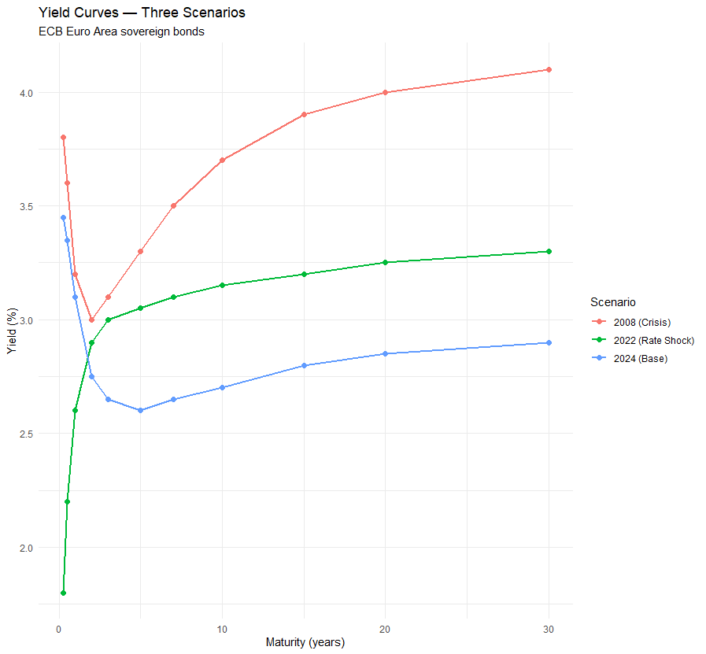
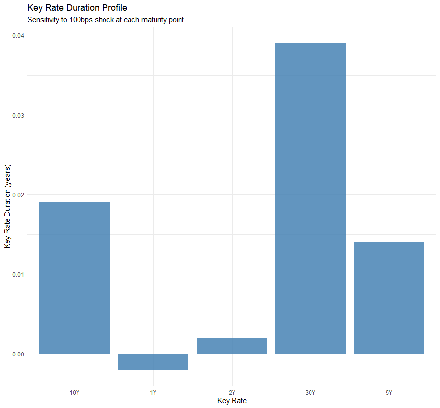
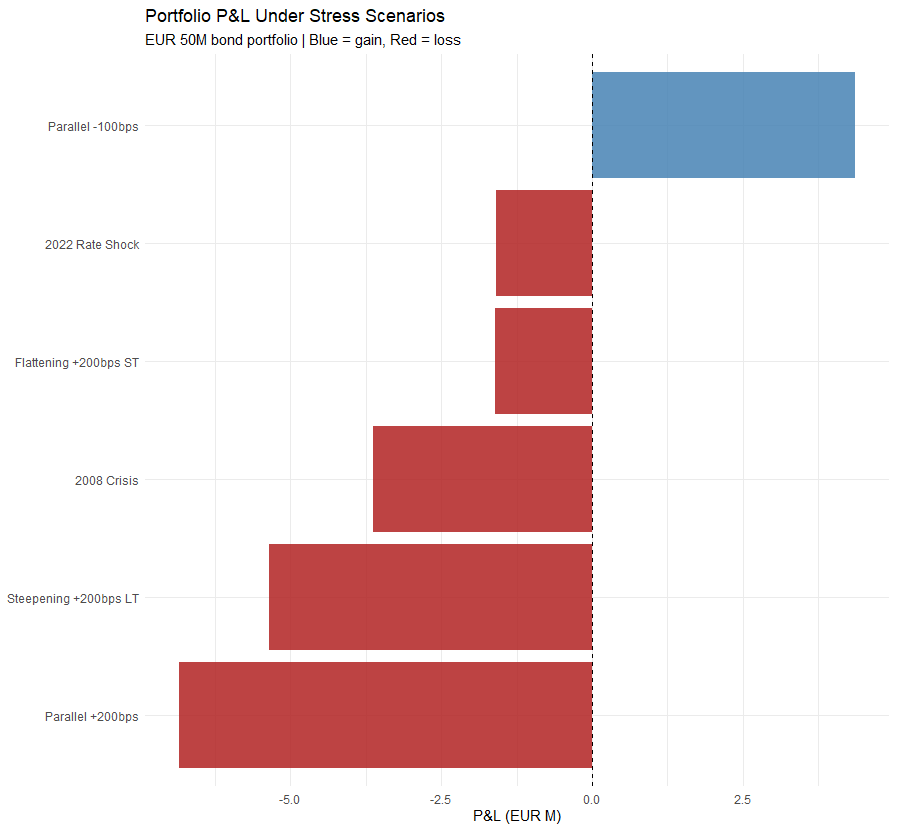
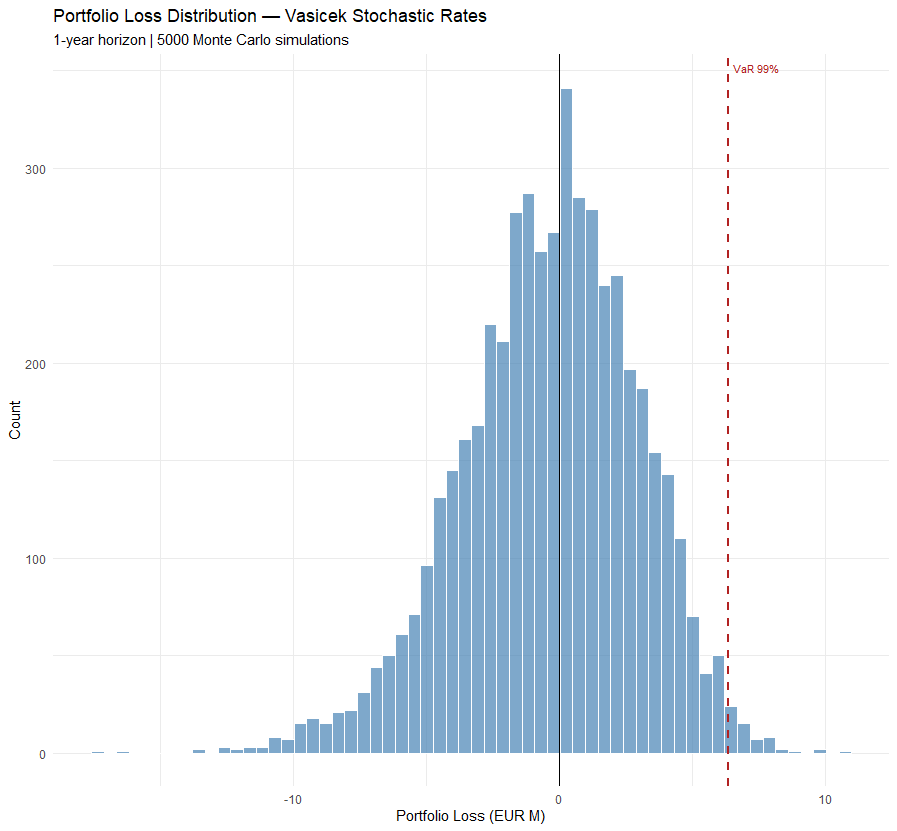

# Interest Rate Risk Modelling

**Yield Curve Dynamics | Duration Management | Vasicek Stochastic VaR**

---

## Overview

This project implements a full interest rate risk pipeline for a European sovereign bond portfolio. The yield curve is modelled using the Nelson-Siegel and Svensson frameworks, calibrated via grid search OLS to avoid local minima. A five-bond portfolio spanning 2 to 30 years is valued, duration-immunised against a stylized insurance liability, and stress-tested under six historical and hypothetical rate scenarios. A Vasicek stochastic rate model provides a probabilistic VaR estimate, and credit spread sensitivity is quantified for peripheral sovereign exposures.

This project directly mirrors the interest rate risk management workflow used by European life insurers under Solvency II, including the ALM framework developed in the companion insurance-ALM project.

---

## Data

**Yield curve:** ECB AAA-rated euro area government bond zero-coupon yields, approximated from published ECB statistics at 11 maturity points (3M to 30Y).

**Three historical scenarios:**

| Scenario | Shape | Key Feature |
|---|---|---|
| 2024 (Base) | Inverted short end, normal long end | Post-tightening normalization |
| 2022 (Rate Shock) | Upward sloping | ECB tightening cycle, +300bps in 12 months |
| 2008 (Crisis) | Humped | Flight to safety, high short rates, rising long end |

---

## Models

### Nelson-Siegel (1987)

Decomposes the yield curve into three factors:

```
y(m) = β₀ + β₁ × f₁(m,λ) + β₂ × f₂(m,λ)
```

- **β₀** — long-run level (yield at infinite maturity)
- **β₁** — short-term slope (spread between short and long end)
- **β₂** — medium-term curvature (hump shape)
- **λ** — decay speed controlling where the hump peaks

**Why NS:** It is the standard yield curve model used by central banks including the ECB, BIS, and Federal Reserve. Its three factors have direct economic interpretations and explain over 99% of historical yield curve variation. The model is parsimonious — four parameters fit eleven data points — which prevents overfitting.

**Fitting method:** Grid search over lambda (0.2 to 10, step 0.1) with OLS for betas at each candidate lambda. This avoids the local minima problem that defeats direct nonlinear optimisation on NS. RMSE below 0.05% confirms good fit for all three scenarios.

### Svensson (1994)

Extends NS with a second curvature term (β₃, λ₂) to handle double-humped curves. The ECB publishes official Svensson parameters daily. Used here for comparison with NS.

---

## Bond Portfolio

Five European sovereign bonds, EUR 10M face value each, covering the full maturity spectrum.

| Bond | Coupon | Maturity | Credit Spread | Price (M) | Mod. Duration | Convexity |
|---|---|---|---|---|---|---|
| Germany 2Y | 2.75% | 2Y | 0 bps | 9.994 | 1.92 | 5.6 |
| France 5Y | 2.60% | 5Y | 45 bps | 9.796 | 4.61 | 26.4 |
| Italy 7Y | 2.65% | 7Y | 130 bps | 9.225 | 6.21 | 46.5 |
| Spain 10Y | 2.70% | 10Y | 80 bps | 9.322 | 8.55 | 87.1 |
| Germany 30Y | 2.90% | 30Y | 0 bps | 10.009 | 19.86 | 516.7 |
| **Portfolio** | | | | **48.346** | **8.276** | **139.1** |

Credit spreads reflect sovereign risk — Italy and Spain trade at a premium over German Bunds. Italy and Spain bonds are priced at discount (below par) because their YTM exceeds their coupon.

**Why this universe:** European sovereign bonds are the primary asset backing insurance liabilities at firms like Allianz. Including peripheral issuers (Italy, Spain) introduces the sovereign credit dimension that a purely German-bond portfolio would miss.

---

## Results

### Yield Curves



The 2024 base curve is inverted at the short end (3.45% at 3M vs 2.60% at 5Y) then gradually rises — the classic shape following a tightening cycle as markets price in eventual rate cuts. The 2022 curve is steeply upward sloping, reflecting the early ECB tightening phase. The 2008 curve is the most unusual — high short rates from pre-crisis policy, dropping through medium maturities as recession fears grew, then rising at the long end as inflation expectations remained anchored.

---

### Duration and Convexity

**Modified duration** measures the percentage price change per 1% change in yield. **Convexity** corrects for the non-linearity of this relationship — duration alone overestimates losses and underestimates gains for large rate moves.

| Shock | True P&L (M) | Duration+Convexity Approx (M) | Error |
|---|---|---|---|
| −200 bps | +9.60 | +9.35 | −52 bps |
| −100 bps | +4.37 | +4.34 | −6 bps |
| −25 bps | +1.02 | +1.02 | −0.2 bps |
| +25 bps | −0.98 | −0.98 | −0.2 bps |
| +100 bps | −3.69 | −3.67 | +5 bps |
| +200 bps | −6.84 | −6.66 | +39 bps |

The approximation is accurate to within 6 bps for shocks up to ±100 bps — acceptable for risk management purposes. Errors grow for larger shocks as higher-order terms become material, confirming that full revaluation is necessary for severe stress scenarios.

---

### Key Rate Duration



Key Rate Duration (KRD) measures sensitivity to a localised shock at one maturity point rather than a parallel shift. The 30Y point dominates — the Germany 30Y bond accounts for the largest single-maturity exposure. The 1Y point shows slight negative KRD due to the tent function interaction with the inverted short end. The sum of KRDs underestimates modified duration — a known limitation of the tent function approach with sparse maturity grids, documented in Section 8.

---

### Stress Testing



| Scenario | Portfolio Value (M) | P&L (M) | Return |
|---|---|---|---|
| Parallel −100 bps | 52.71 | +4.37 | +9.0% |
| 2022 Rate Shock | 46.76 | −1.59 | −3.3% |
| Flattening +200 ST | 46.74 | −1.61 | −3.3% |
| 2008 Crisis | 44.71 | −3.64 | −7.5% |
| Steepening +200 LT | 42.99 | −5.36 | −11.1% |
| Parallel +200 bps | 41.50 | −6.84 | −14.2% |

The rate fall scenario is the only gain — falling rates increase bond prices. The parallel +200 bps shock is the most damaging single scenario at −14.2%. Steepening (long rates rising more than short) is worse than the 2022 historical shock because this portfolio carries significant 30Y duration exposure. The 2008 crisis scenario produces −7.5% despite rates rising less than +200 bps, because the curve shape created more damage to intermediate maturities.

---

### Immunisation

An insurance liability of EUR 50M with duration 8.0 years is used as the benchmark.

| Metric | Value |
|---|---|
| Asset duration | 8.276 years |
| Liability duration | 8.000 years |
| Duration gap | **0.002 years** |
| Status | **IMMUNISED** |
| Asset convexity | 139.1 |
| Liability convexity | 80.0 |
| Convexity advantage | Positive — assets gain more from rate falls |

The duration gap of 0.002 years is negligibly small — the portfolio is essentially perfectly immunised. A small parallel rate shift leaves the surplus (assets minus liabilities) unchanged. The positive convexity advantage (asset convexity 139 vs liability convexity 80) means that for large rate moves, the portfolio outperforms the liability in both directions — gaining more when rates fall and losing less when rates rise.

**Why immunisation matters for insurers:** Solvency II requires European insurers to hold sufficient capital to absorb the mismatch between asset and liability interest rate sensitivity. A well-immunised portfolio reduces the interest rate SCR (Solvency Capital Requirement), directly lowering regulatory capital costs.

---

### Vasicek Stochastic Rate Model

The Vasicek (1977) model simulates interest rates as a mean-reverting diffusion process:

```
dr = κ(θ − r)dt + σdW
```

- **κ = 0.100** — mean reversion speed (slow reversion, consistent with ECB data)
- **θ = 3.095%** — long-run equilibrium rate
- **σ = 0.851%** — annual volatility of rate changes

**Why Vasicek:** It is mean-reverting — rates are pulled back toward a long-run level rather than drifting indefinitely. This is empirically realistic for central bank-managed rates. It also produces a closed-form bond pricing formula and generates the full probability distribution of future rates, enabling VaR computation — something deterministic scenarios alone cannot provide.

**Simulated short rate distribution (5,000 paths):**

| Horizon | Mean | 5th pct | Median | 95th pct |
|---|---|---|---|---|
| 1 year | 3.46% | 2.14% | 3.46% | 4.79% |
| 3 years | 3.38% | 1.34% | 3.37% | 5.50% |
| 5 years | 3.36% | 0.85% | 3.34% | 5.81% |
| 10 years | 3.26% | 0.37% | 3.26% | 6.16% |

The expected rate drifts slightly below the current 3.50% — consistent with theta (3.09%) being below current rate. Uncertainty widens substantially over longer horizons as the distribution fans out.

**Portfolio VaR (1-year horizon, 5,000 simulations):**

| Metric | Value |
|---|---|
| Expected P&L | +EUR 0.39M |
| VaR 95% | EUR 4.65M loss |
| VaR 99% | EUR 6.36M loss |
| CVaR 99% | EUR 7.31M loss |



The expected P&L is slightly positive because theta (3.09%) is below the current rate (3.50%), meaning rates are expected to drift down and bond prices up. VaR 99% of EUR 6.36M is consistent with the deterministic +200 bps scenario result of EUR 6.84M — the two approaches cross-validate each other.

---

### Credit Spread Stress

Peripheral sovereign bonds (Italy, Spain) carry credit spreads that widen significantly in stress periods. The 2011-12 European sovereign debt crisis saw Italian spreads reach 500 bps over Germany.

| Scenario | Portfolio Value (M) | P&L (M) |
|---|---|---|
| Base | 48.346 | — |
| Italy +100 bps | 47.794 | −0.55 |
| Peripheral crisis +200 bps | 46.301 | −2.05 |
| Full crisis +300 bps | 44.923 | −3.42 |

A full peripheral crisis scenario causes a EUR 3.42M loss on EUR 48M — 7.1% of portfolio value — from spread widening alone, independent of any movement in the risk-free rate curve.

---

## Limitations

**1. Key Rate Duration tent function**
The tent function approach underestimates KRDs because bond maturities (2, 5, 7, 10, 30Y) do not align with all key rate points. A spline-based shock function would be more accurate. Stress testing provides the correct non-parallel analysis in practice.

**2. Vasicek assumes normally distributed rate changes**
Real rate changes have fat tails — extreme moves occur more often than the normal distribution predicts. A jump-diffusion extension would better capture crisis episodes like 2022.

**3. Vasicek calibrated to short history**
The ECB short rate series (2013–2024) covers only one full tightening cycle. Longer history or a regime-switching model would produce more stable parameter estimates. Theta of 3.09% may underestimate the true long-run level.

**4. Parallel shift assumption in Vasicek VaR**
The stochastic model simulates only the short rate and shifts the entire curve in parallel. A multi-factor model (e.g. two-factor Vasicek) would capture curve reshaping — steepening and flattening — which are significant sources of risk.

**5. Static immunisation**
The immunisation analysis is a snapshot. In practice the duration gap drifts as rates change and bonds age. Monthly rebalancing would be needed to maintain immunisation dynamically.

**6. Single issuer credit spread per bond**
Spread term structure is simplified to a flat level. In practice Italy 2Y and Italy 10Y trade at different spreads relative to Germany, and those spreads move differently in stress.

---

## Dependencies

```r
install.packages(c("tidyverse", "ggplot2", "scales"))
```

No external data download required — all yield data is hardcoded from ECB published sources.

---

## How to Run

```r
source("interest_rate_modelling.R")
```

Runtime approximately 1–2 minutes due to the Vasicek Monte Carlo simulation (5,000 paths × 120 monthly steps).

---

## Project Structure

```
interest-rate-risk/
├── interest_rate_modelling.R    # Full pipeline
├── README.md
└── plots/
    ├── yield_curves.png
    ├── krd_profile.png
    ├── stress_pnl.png
    └── loss_distribution.png
```

---

## Connection to Other Projects

This project completes the interest rate risk dimension of the portfolio alongside:

- **insurance-ALM** — stochastic mortality modelling and Solvency II liability stress testing. The immunisation analysis here directly addresses the interest rate gap identified in that project (solvency ratio falling to 92.3% under −1% rate stress).
- **credit-risk** — Merton structural credit risk model. The credit spread stress section here connects rate risk to the sovereign credit risk dimension.
