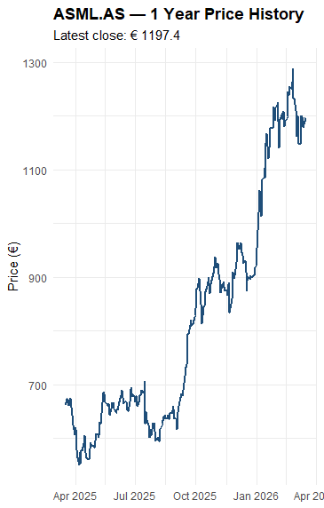
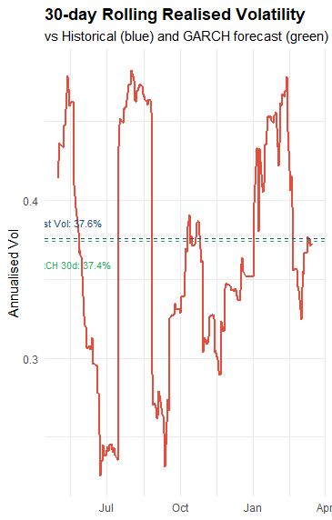
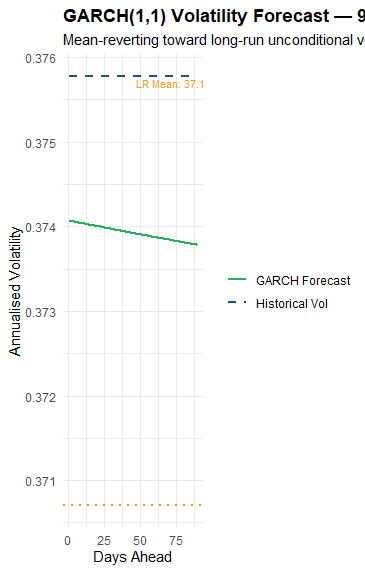
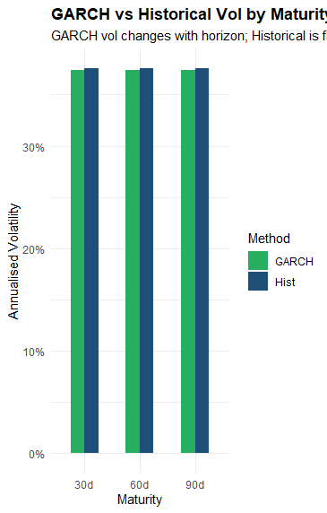
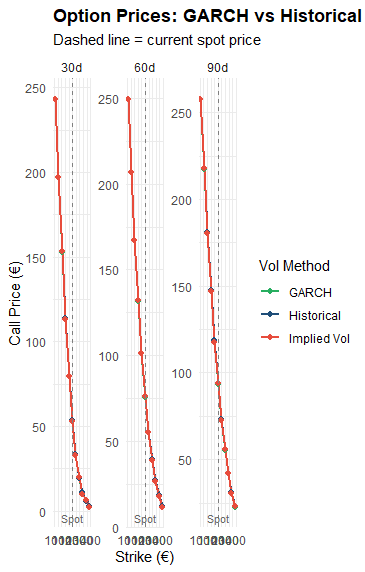
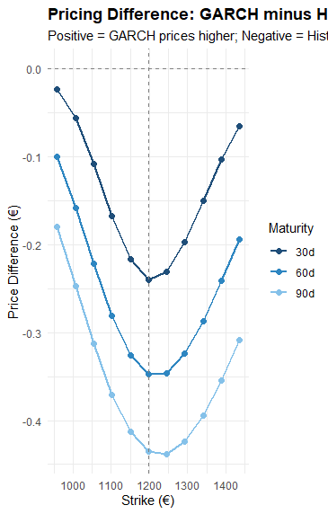
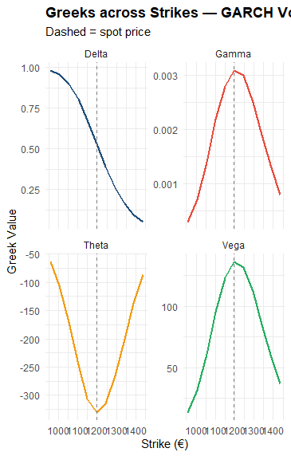

## Results

### ASML Price History

The price shows a strong upward trend with periods of volatility clustering, indicating changing market regimes and justifying the use of time-varying volatility models like GARCH.

---

### Rolling Realised Volatility

Volatility varies significantly over time, with clear clustering. This highlights the limitation of constant volatility assumptions and motivates dynamic models such as GARCH.

---

### GARCH Volatility Forecast

The GARCH forecast shows mean reversion toward long-run volatility, capturing the tendency of volatility to stabilise after periods of stress.

---

### GARCH vs Historical Volatility

GARCH volatility varies across maturities, reflecting forward-looking dynamics, while historical volatility remains constant, ignoring changes in market conditions.

---

### Option Prices: GARCH vs Historical vs Implied Vol

Pricing differences arise due to different volatility assumptions. GARCH incorporates recent market conditions, while historical volatility is static and implied volatility reflects market expectations.

---

### Pricing Difference (GARCH − Historical)

Negative differences indicate that historical volatility is higher than GARCH forecasts, suggesting that recent volatility has decreased relative to past averages.

---

### Greeks across Strikes (GARCH Vol)

Risk sensitivities are concentrated near at-the-money options, where Gamma and Vega peak. This shows that small changes in price or volatility have the greatest impact in this region.
